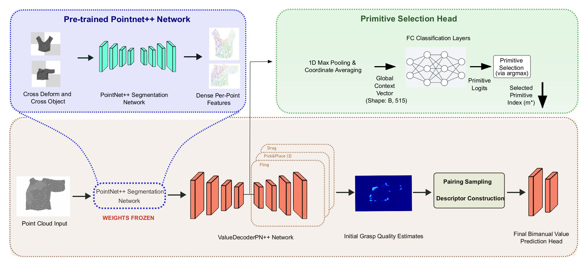

# FCBV-Net: Category-Level Robotic Garment Smoothing via Feature-Conditioned Bimanual Value Prediction

**Authors:** Mohammed Daba, Jing Qiu  
**Paper:** [ArXiv](https://arxiv.org/abs/2508.05153)  
**Website:** [FCBV](https://dabaspark.github.io/fcbvnet/)

<p align="center">
  
</p>


## Status:

The official implementation code for FCBV-Net will be released here soon upon accepting our paper for publication. 
For any inquires please contact [Email](m.abdulwahab.daba@gmail.com)

### Abstract
Category-level generalization for robotic garment manipulation, such as bimanual smoothing, remains a significant hurdle due to high dimensionality, complex dynamics, and intra-category variations. Current approaches often struggle, either overfitting with concurrently learned visual features or failing to predict the value of synergistic actions. We propose the **Feature-Conditioned Bimanual Value Network (FCBV-Net)**, operating on 3D point clouds to specifically enhance category-level policy generalization. Code, videos, and supplementary materials are available at the project website: https://dabaspark.github.io/fcbvnet/.


### Citation
If you find this work useful, please cite:

```bibtex
@misc{daba2026fcbvnet,
      title={FCBV-Net: Category-Level Robotic Garment Smoothing via Feature-Conditioned Bimanual Value Prediction}, 
      author={Mohammed Daba and Jing Qiu},
      year={2026},
      eprint={2508.05153},
      archivePrefix={arXiv},
      primaryClass={cs.RO}
}
